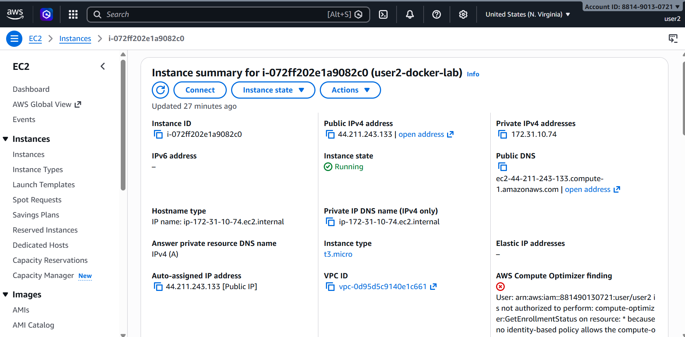
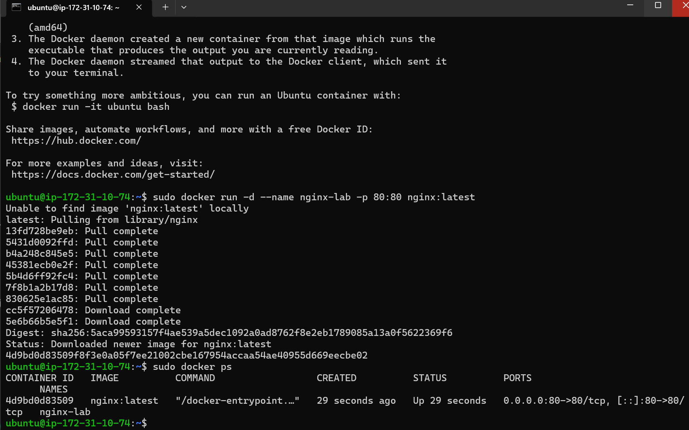
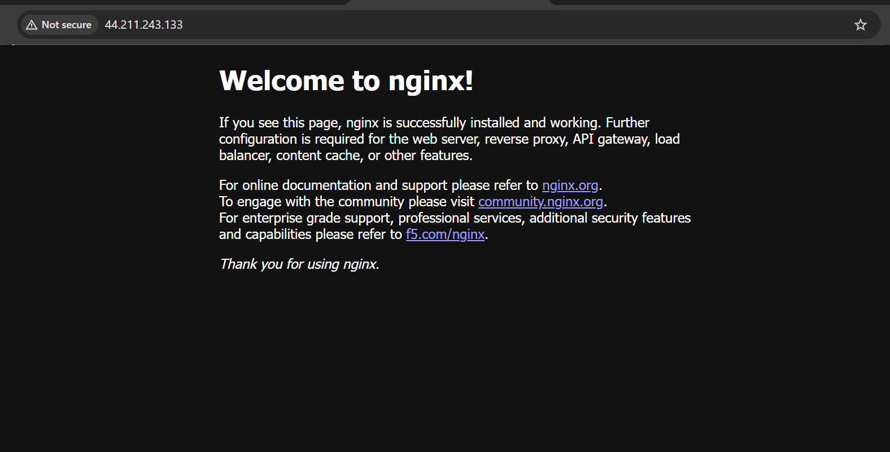

# AWS Docker Nginx Lab

## Goal
Create an Ubuntu EC2 instance on AWS, install Docker, and run an Nginx container accessible from the browser.

## Technologies
- AWS EC2
- Ubuntu
- Docker
- Nginx

## Steps Performed

1. Created Ubuntu EC2 instance
2. Configured Security Groups
3. Connected using SSH
4. Installed Docker
5. Ran hello-world container
6. Ran Nginx container
7. Verified browser access

## Docker Command Used

## Screenshots








```bash
sudo docker run -d --name nginx-lab -p 80:80 nginx:latest


```text
